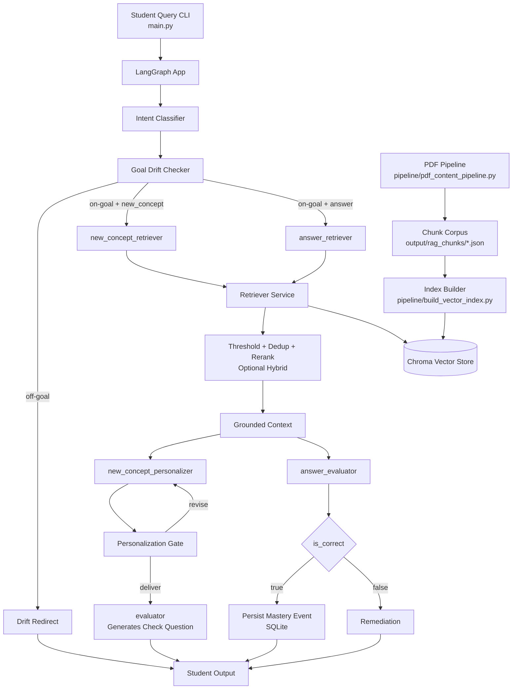



# NeuroLearn: Adaptive AI Tutor for Neurodivergent Learners

[](https://www.python.org/downloads/release/python-390/)
[](https://opensource.org/licenses/MIT)
[](https://github.com/ellerbrock/open-source-badges/)
[](http://makeapullrequest.com)

**NeuroLearn** is an open-source, adaptive AI tutoring platform designed specifically for **neurodivergent students**. Recognizing that everyone learns differently, our AI dynamically tailors its teaching approach to suit individual needs.

NeuroLearn focuses on student-centered learning support with adaptive explanations, guided remediation, mastery tracking, and profile-aware tutoring so each learner can progress in a way that works for them.

## 📑 Table of Contents
- [Highlights](#-highlights)
- [Visual Architecture Diagram](#-visual-architecture-diagram)
- [Quick Start](#-quick-start)
- [Usage](#-usage)
- [Guides and Concepts](#-guides-and-concepts)
- [Philosophy](#-philosophy)

## ✨ Highlights

- **Adaptive Learning AI:** Automatically adjusts its teaching approach based on the student's specific neurodivergent profile, learning style, and reading age.
- **Guided Focus & Remediation:** Features a LangGraph-based tutor with learning-goal drift checking to gently guide students back on track if they lose focus.
- **Mastery Tracking:** Persists learning milestones and mastery events (via SQLite) to continuously improve the AI's understanding of the student over time.
- **Personalized Check Questions:** Generates follow-up checks to confirm understanding before moving to the next concept.
- **Source-Grounded Answers:** Keeps traceable links to learning content so explanations can be tied back to where the concept came from.
- **Smalltalk-Aware Routing:** Recognizes greetings/thanks and responds via the LLM without hitting retrieval. If a check question is pending, answers the smalltalk then reprints the reminder.
- **No-Docs Guardrail:** Suppresses answers when retrieval returns no passages and returns a clear error message.
- **Retrieval Hardening:** Filters weak chunks, deduplicates near-duplicates, and reranks candidates before they reach the prompt.
- **Topicality Guard:** Suppresses check questions when retrieved passages are too weak or off-topic. Uses embedding similarity + lexical overlap thresholds.
- **Answer Evaluation Fast Path:** Heuristic concept-key mapping and overlap-based correct-answer detection skip LLM calls for obvious cases.
- **Retrieval Caching:** Repeated queries reuse prior retrieval results, with invalidation tied to vector index state.
- **Incremental Indexing:** OCR pipeline and vector index builds skip unchanged PDFs/chunks, making refreshes fast.
- **Per-Node Timing:** Each graph node reports its execution time, making it easy to spot bottlenecks.
- **Interactive CLI Routing Fix:** Detects whether user input is a new question vs. an answer to a pending check question, preventing confusing misroutes.
- **Fallback Answers:** When retrieval is thin or the model refuses, a general fallback answer is returned instead of a dead end.
- **Story Mode:** Type `story` after any answer to get a child-friendly Malayalam story version. Also available via `--story` flag and API endpoint `GET /api/conversations/{sid}/{cid}/{tid}/story`.
- **Chapter Mode:** Lets students pick a PDF chapter and optionally drill into a specific module (മൊഡ്യൂള്). Loads only relevant chunks for focused practice.
- **Story Generation:** In learn mode, generates a single continuous Malayalam story from all module chunks with a moral paragraph (കഥയുടെ പാഠം). Uses `max_tokens=5000` for longer narratives.
- **Manual Module Override:** `chapter_modules.csv` lets you hand-edit page ranges per module, overriding auto-detection when needed.

## 🧭 Visual Architecture Diagram



## Quick Start

### Prerequisites
Core runtime:

| Dependency | Installation |
|---|---|
| **Python** | 3.9 or higher |
| **Groq API Key** | Set `GROQ_API_KEY` in `.env` or your shell |

Pre-generated chunk files are already included in `output/rag_chunks/`, so you can run the tutor without OCR setup.

Optional (only if you run the PDF content pipeline):

| Dependency | Installation |
|---|---|
| **Tesseract OCR** | `sudo apt install tesseract-ocr` or [Windows Installer](https://github.com/UB-Mannheim/tesseract/wiki) |
| **Malayalam Data** | `sudo apt install tesseract-ocr-mal` (Linux). For Windows, place `mal.traineddata` in the `tessdata` directory. |
| **Poppler** | `sudo apt install poppler-utils` or [Poppler for Windows](https://github.com/oschwartz10612/poppler-windows) (required by `pdf2image`) |

### Setup & Installation
1. **Clone the repository:**
   ```bash
   git clone https://github.com/arxhr007/neurolearn.git
   cd neurolearn
   ```

2. **Install Python dependencies:**
   ```bash
   pip install -r requirements.txt
   ```

3. **Configure the Environment:**
   Create a `.env` file in the project root to store your Groq API Key (required for `main.py`):
   ```env
   GROQ_API_KEY=your_key_here
   ```

4. **Build the local vector index (required once):**
   ```bash
   python pipeline/build_vector_index.py
   ```

## 🎯 Usage

### 0. FastAPI Web API (Phase 4)

Run the API server:

```bash
uvicorn api_main:app --host 0.0.0.0 --port 8000
```

Open API docs:

- Swagger UI: `http://localhost:8000/api/docs`
- Redoc: `http://localhost:8000/api/redoc`

Development login users:

- student: `student@neurolearn.local` / `student123`
- teacher: `teacher@neurolearn.local` / `teacher123`
- admin: `admin@neurolearn.local` / `admin123`

Example login request:

```bash
curl -X POST http://localhost:8000/api/auth/login \
   -H "Content-Type: application/json" \
   -d '{"email":"admin@neurolearn.local","password":"admin123","role":"admin"}'
```

Role-based workflow (API):
- Admin manages teachers: `GET/POST/PUT /api/admin/teachers`
- Teacher manages students: `GET/POST/PUT /api/teacher/students`
- Teacher assigns goals: `GET/POST /api/teacher/students/{student_id}/goals`
- Teacher monitors students: `GET /api/teacher/students/{student_id}/mastery` and `.../conversations`

### 1. LangGraph AI Tutor Application
Manage student profiles and interact with the adaptive AI tutor.

**Create/Update a student profile:**
```bash
# Interactive mode
python manage_student_db.py

# Non-interactive mode (Example: Student with ADHD & Dyslexia, learns best through analogies)
python manage_student_db.py add --student-id s100 --name "Test User" \
  --learning-style analogy-heavy --reading-age 12 --interests chess football \
  --neuro-profile adhd dyslexia
```

**Set Active Learning Goal:**
```bash
python manage_student_db.py set-goal --student-id s100 --goal "Learn handwashing and hygiene basics"
```

**Run a Query:**
```bash
# Run once after clone (or after updating chunks)
python pipeline/build_vector_index.py

# Start tutor
python main.py --student-id s100

# Then type your question interactively when prompted
# Example: കൈകഴുകൽ എന്തുകൊണ്ട് പ്രധാനമാണ്?

# Optional retrieval tuning for stricter grounding
python main.py --student-id s100 \
   --retrieval-candidate-k 20 \
   --retrieval-min-similarity 0.35
```

**Opt-in features:**
- **Story Mode:** After any answer, type `story` at the prompt to get a child-friendly Malayalam story version. Also available via `--story` flag for single-query mode.
- **Chapter Mode:** Type `chapter` at the prompt to enter a drill harness grounded in a specific PDF chapter (and optionally a module within it). Also available via `--chapter-mode` flag.

**Behavior notes:**
- Greetings/thanks are treated as smalltalk and answered without retrieval.
- If no sources are found, the CLI returns an explicit no-sources error instead of a generated answer.

**Inspect Profile & Mastery:**
```bash
python manage_student_db.py get --student-id s100
python manage_student_db.py mastery --student-id s100 --limit 20
```

### 2. Optional Content Processing Pipeline
Use this only when you want NeuroLearn to teach from your own/new Malayalam educational PDFs.

```bash
# Default (Reads from input/pdfs, outputs to output/rag_chunks)
python pipeline/pdf_content_pipeline.py

# Custom configurations
python pipeline/pdf_content_pipeline.py \
    --input ./input/pdfs \
    --output ./output/rag_chunks \
    --workers 8 \
    --dpi 300 \
    --chunk-size 500 \
    --chunk-overlap 100

# Build / refresh the vector index from generated chunks
python pipeline/build_vector_index.py
```

### 3. Run with Docker
```bash
docker compose -f docker/docker-compose.yml up --build
```

### 4. Verify the app
```bash
# Health check
curl http://localhost:8000/api/health

# Smoke test
python test_api.py
```


## 📄 License
This project is open-source and available under the [MIT License](LICENSE).

## 📚 Guides and Concepts
To understand the project and how to work with it, start with these docs:
- **[how_to.md](how_to.md)**: Complete run guide covering CLI, API, web app, Docker, verification, data pipelines, Story Mode, and Chapter Mode with module selection.
- **[SETUP.md](docs/SETUP.md)**: Local installation, environment variables, and smoke test steps.
- **[WEB_PRODUCT_DESIGN.md](docs/WEB_PRODUCT_DESIGN.md)**: Product boundary, API contracts, frontend logic, and deployment architecture for web migration (student tutor UI + admin dashboard + single-VPS target).
- **[FRONTEND_API_INTEGRATION.md](docs/FRONTEND_API_INTEGRATION.md)**: Practical frontend integration guide with auth flow, request/response examples, and endpoint-by-endpoint usage.
- **[ARCHITECTURE.md](docs/ARCHITECTURE.md)**: System design, runtime flow, and main components.
- **[INTERFACES.md](docs/INTERFACES.md)**: Entry points, services, and important project-level interfaces.
- **[DATA_FORMATS.md](docs/DATA_FORMATS.md)**: Student profile, mastery, chunk, and vector store formats.
- **[TROUBLESHOOTING.md](docs/TROUBLESHOOTING.md)**: Common setup and runtime issues.
- **[CONTRIBUTING.md](docs/CONTRIBUTING.md)**: How to work on the repo safely.
- **[DEPLOYMENT.md](docs/DEPLOYMENT.md)**: Current CLI-first deployment notes and what would need to change for hosting.
- **[EXAMPLES.md](docs/EXAMPLES.md)**: Example student flows and pipeline usage.
- **[TESTING.md](docs/TESTING.md)**: Validation checklist and testing workflow.

Chapter mode with module selection:
- `chapter_modules.csv` — manually editable page ranges for each module (source, module, start_page, end_page). Overrides auto-detection when present. See [how_to.md](how_to.md) §10 for details.

Internal notes and build history:
- **[FLOW.md](docs/FLOW.md)**: Detailed mapping of the data flow and AI interactions.
- **[plan.md](docs/plan.md)**: Roadmap, goals, and architectural plans.
- **[FROM_SCRATCH_SUMMARY.md](docs/FROM_SCRATCH_SUMMARY.md)**: A summary of how the project was built and its foundational principles.

## 💡 Philosophy

> "If a child can't learn the way we teach, maybe we should teach the way they learn."  
> — Ignacio Estrada

NeuroLearn is built on the belief that **education should adapt to the student, not the other way around.** Traditional, one-size-fits-all learning paradigms often leave neurodivergent learners behind, creating unnecessary friction in their educational journeys. By leveraging AI to understand, accommodate, and grow alongside each unique mind, we strive to build an inclusive environment where every learner can achieve mastery and confidence in their own way.

