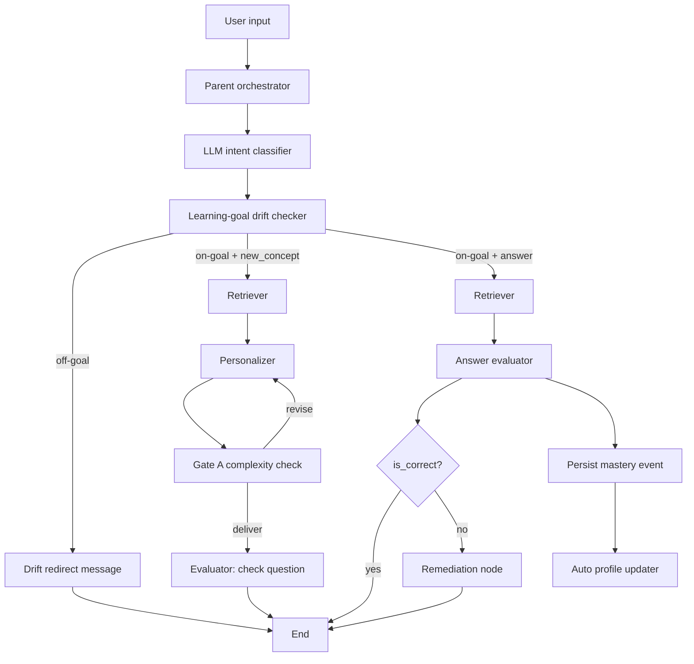

# NeuroLearn Tutor System: From Scratch to Current State

This document explains everything built in this repository from the beginning, in order, and how the current system works end-to-end.

## Document Status

- Scope: chronological implementation history
- Audience: developers and project stakeholders
- Status: current MVP change log summary

## 1) Starting Point

Initial project goal:
- Read and understand Neuro Learn PDF content.
- Build a Malayalam-friendly retrieval + tutoring system.
- Move from a basic RAG flow to a modular graph-based tutor with personalization and evaluation.

Initial repository had:
- PDF processing scripts and chunk outputs.
- Vector store data.
- Basic RAG logic.

## 2) Phase-by-Phase Build History

### Phase A: Content Extraction and Documentation

What was done:
- Extracted PDF content and produced Markdown-friendly outputs.
- Created architecture planning docs and Mermaid diagrams.
- Iterated diagrams for clarity, simplification, and correctness.

Outcome:
- Clear functional blueprint for the full tutor pipeline.
- Shared understanding of system flow before deeper code changes.

### Phase B: Modularization for LangGraph

What changed:
- Refactored into a modular package structure (`langgraph_app`).
- Split responsibilities into:
  - Config
  - Typed state
  - Services (retriever, llm, db)
  - Intent classifiers
  - Graph nodes
  - Graph builder
  - CLI

Outcome:
- Maintainable architecture with clear boundaries.
- Easier to add new nodes and routing behavior.

### Phase C: Intent-Based Routing

What changed:
- Added intent classification node.
- Added LLM-based intent classifier with fallback rules.
- Added Malayalam-aware behavior.
- Added routing:
  - `new_concept` path
  - `answer` path

Outcome:
- Different user inputs now follow different pedagogical flows.

### Phase D: Student Profile from SQLite

What changed:
- Replaced hardcoded profile usage with SQLite-backed profiles.
- Added student database service.
- Added management script to add/get/list students.
- Runtime now requires `--student-id` and loads that profile for all decisions.

Outcome:
- Real per-student profile support.
- Personalization is now identity-aware.

### Phase E: Personalization and Gate A

What changed:
- Added personalized explanation node for `new_concept`.
- Implemented Gate A complexity check.
- Evolved Gate A from simple rules to LLM-based judging.
- Hardened parsing and fallback handling.
- Added explicit logs showing whether decision came from LLM or fallback.

Outcome:
- Safer delivery: explanations can be revised when too complex.
- More reliable operational behavior under model variability.

### Phase F: Evaluator for Learning Check

What changed:
- Added evaluator node in `new_concept` path.
- Generates a check-for-understanding question in Malayalam.

Outcome:
- The system now checks understanding, not only explains.

### Phase G: Answer Evaluator

What changed:
- Added answer-evaluator node for answer-like input.
- Uses retrieved context to assess student response.
- Returns structured output:
  - `is_correct`
  - `feedback`
  - `misconception`
  - `confidence`

Outcome:
- Tutor can evaluate student responses instead of always generating another answer.

### Phase H: Mastery Persistence

What changed:
- Added `mastery_events` table in SQLite.
- Persisted fields:
  - `student_id`
  - `concept_key`
  - `is_correct`
  - `misconception`
  - `confidence`
  - `source_doc`
  - `source_page`
  - `source_chunk_id`
  - timestamp (`created_at`)
- Added query support to inspect mastery history.

Outcome:
- Progress tracking now exists beyond single-turn evaluation.

### Phase I: Remediation Branch

What changed:
- Added conditional routing after answer evaluation:
  - If correct: end.
  - If incorrect: remediation node.
- Added remediation generation:
  - Simpler corrected explanation
  - Encouraging tone
  - Retry hint
- CLI now displays remediation block and supports retry in interactive mode.

Outcome:
- Learning loop is now corrective, not just judgmental.

### Phase J: Profile Updater

What changed:
- Added profile updater driven by recent mastery events.
- Auto-adjusts:
  - `reading_age` (within bounds)
  - `interest_graph` (adds strong recurring topics)
- Invoked automatically after mastery recording in answer evaluation flow.
- Added guardrails to prevent unstable reading-age drift:
  - Minimum attempts before change (8)
  - Hysteresis thresholds (`>= 0.80` to increase, `<= 0.35` to decrease)
  - Cooldown (at most one reading-age change per 10 mastery events)
- Added `profile_update_meta` tracking table to persist reading-age cooldown state.

Outcome:
- Student profile can adapt based on performance trends.
- Reading-age updates are now stable and less noisy.

### Phase K: Learning-Goal Drift Checker

What changed:
- Added active learning-goal storage in SQLite.
- Added LLM-based goal alignment checker after intent classification.
- Added drift redirect path:
  - If query is off-goal, respond with a short Malayalam refocus message.
  - If query is on-goal, continue normal tutor flow.
- Added goal management commands in `manage_student_db.py`:
  - `set-goal`
  - `active-goal`
  - `goals`

Outcome:
- Off-topic queries are intercepted early and redirected toward current learning objectives.

### Phase L: Neurodivergent Profile Adaptation + Source Tracing

What changed:
- Added `neuro_profile` support to student profiles (for example: `adhd`, `autism`, `dyslexia`, or custom labels).
- Updated all response-generating LLM nodes to adapt communication style to learner support needs.
- Kept known-condition guidance and added open-ended handling for custom condition labels.
- Added answer source tracing in CLI output:
  - textbook name
  - page
  - `chunk_id` (or vector id fallback)
  - JSON file hint under `output/rag_chunks/`

Outcome:
- Responses are now better tailored for neurodivergent learners.
- Every answer is easier to audit against retrieved chunk sources.

## 3) Current End-to-End Runtime Flow



## 4) Data Model Snapshot

### Students table
- `student_id` (PK)
- `name`
- `learning_style`
- `reading_age`
- `interest_graph` (JSON)
- `neuro_profile` (JSON)
- `created_at`
- `updated_at`

### Mastery events table
- `id` (PK)
- `student_id` (FK)
- `concept_key`
- `is_correct`
- `misconception`
- `confidence`
- `source_doc`
- `source_page`
- `source_chunk_id`
- `created_at`

### Profile update meta table
- `student_id` (PK/FK)
- `last_reading_age_update_event_id`

### Learning goals table
- `id` (PK)
- `student_id` (FK)
- `goal_text`
- `is_active`
- `created_at`
- `updated_at`

## 5) Operational Commands

### Add/update student

```powershell
python .\manage_student_db.py
# or: python .\manage_student_db.py add --student-id s1 --name "Test User" --learning-style analogy-heavy --reading-age 12 --interests chess football --neuro-profile adhd dyslexia
```

### Get student

```powershell
python .\manage_student_db.py get --student-id s1
```

### List students

```powershell
python .\manage_student_db.py list
```

### Show mastery history

```powershell
python .\manage_student_db.py mastery --student-id s1 --limit 10
```

### Set active learning goal

```powershell
python .\manage_student_db.py set-goal --student-id s1 --goal "Learn handwashing and hygiene basics"
```

### Show active learning goal

```powershell
python .\manage_student_db.py active-goal --student-id s1
```

### List learning goals

```powershell
python .\manage_student_db.py goals --student-id s1 --limit 10
```

### Single query run

```powershell
python .\main.py --student-id s1 --text "<your malayalam input>"
```

### Interactive run

```powershell
python .\main.py --student-id s1
```

## 6) What Is Working Now

- Intent classification with source-aware behavior.
- Smalltalk intent routing with LLM-generated replies (no hardcoded responses).
- Retrieval-backed Malayalam generation.
- No-docs guardrail that blocks answers when retrieval returns zero passages.
- Personalization with profile inputs.
- Gate A complexity decisioning.
- Evaluator check-question generation.
- Answer evaluation with structured scoring.
- Mastery persistence and history queries.
- Remediation branch for incorrect answers.
- Auto profile updates based on recent outcomes with drift-resistant guardrails.
- Learning-goal drift detection and redirect handling.
- Neurodivergent-profile-aware response adaptation across LLM nodes.
- CLI answer source tracing with textbook/page/chunk/json references.

## 7) Known Caveats

- Semantic `concept_key` generation is rule-assisted and may still be noisy in edge cases.
- Model outputs can vary; robust parsing and fallback are present but not perfect.
- Learning-goal drift checker depends on LLM semantic judgment and may occasionally over/under-detect drift.

## 8) Suggested Next Steps (Later)

- Add drift-event logging for analytics (how often learners go off-goal).
- Add mastery summary views (per concept, per week).
- Add evaluation regression tests with fixed Malayalam samples.
- Add automated unit/integration tests for node-level routing and DB side effects.

---

This repository has now evolved from static RAG behavior into an adaptive tutor loop with evaluation, remediation, progress tracking, and profile adaptation.

## Related Docs

- [README.md](README.md)
- [FLOW.md](FLOW.md)
- [plan.md](plan.md)

